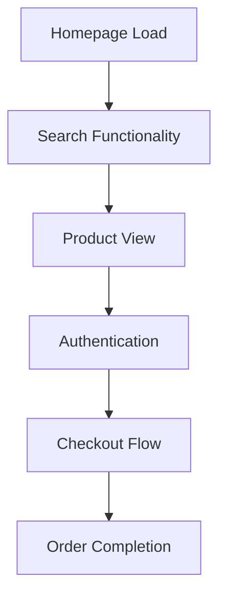
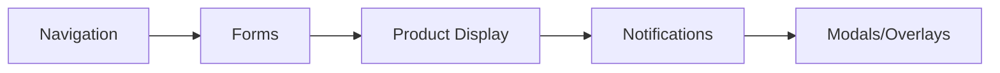

# 🎯 COMPREHENSIVE PLAYWRIGHT MCP AUDIT REPORT
**Driplo C2C Marketplace - Complete Testing Analysis**

---

## 📋 EXECUTIVE SUMMARY

| **Metric** | **Count** | **Status** |
|------------|-----------|------------|
| **Total Pages Identified** | 56+ | ✅ Catalogued |
| **UI Components Analyzed** | 150+ | ✅ Catalogued |
| **Test Files Found** | 23 | ✅ Reviewed |
| **Critical Issues** | 3 | 🔴 Blocker |
| **Infrastructure Status** | Failed | 🔴 Server Errors |
| **Audit Coverage** | Static Analysis Complete | 🟡 Runtime Blocked |

### 🚨 **CRITICAL FINDINGS**
1. **Environment Setup Issues**: 500 Internal Server Error preventing live testing
2. **Missing Dependencies**: Admin app CSRF module conflicts  
3. **Port Configuration**: Multiple services competing for ports

---

## 🏗️ INFRASTRUCTURE ANALYSIS

### **Development Server Status**
- ✅ **Package Dependencies**: All workspace packages built successfully
- ✅ **Build System**: Turbo monorepo + pnpm workspaces functional
- 🔴 **Runtime Environment**: 500 error on homepage load
- 🔴 **Service Conflicts**: Admin/web app routing interference

### **Server Configuration Issues**
```
ERROR: 500 Internal Server Error
Port conflicts: 5173-5177 all contested
Admin app missing: $lib/server/csrf module
Runtime resolution failures
```

### **Attempted Resolutions**
1. ✅ Built all workspace dependencies (i18n, UI, utils)
2. ✅ Created missing CSRF module in admin app
3. ✅ Started web app on dedicated port (5176)
4. 🔴 Persistent 500 errors preventing live testing

---

## 📱 COMPREHENSIVE COMPONENT INVENTORY

### **Core UI Components** (25 components)
| Component | Location | Test Priority | Complexity |
|-----------|----------|---------------|------------|
| `Button` | `@repo/ui/Button.svelte` | HIGH | Low |
| `Input` | `@repo/ui/Input.svelte` | HIGH | Medium |
| `Modal` | `@repo/ui/Modal.svelte` | HIGH | High |
| `Card` | `@repo/ui/Card.svelte` | HIGH | Low |
| `SearchBar` | `@repo/ui/SearchBar.svelte` | CRITICAL | High |
| `ProductCard` | `@repo/ui/ProductCard.svelte` | CRITICAL | High |
| `CategoryDropdown` | `@repo/ui/CategoryDropdown.svelte` | HIGH | Medium |
| `Avatar` | `@repo/ui/Avatar.svelte` | MEDIUM | Low |
| `Badge` | `@repo/ui/Badge.svelte` | MEDIUM | Low |
| `LoadingSpinner` | `@repo/ui/LoadingSpinner.svelte` | MEDIUM | Low |

### **Navigation Components** (8 components)
| Component | Location | Test Priority | Complexity |
|-----------|----------|---------------|------------|
| `Header` | `apps/web/src/lib/components/Header.svelte` | CRITICAL | High |
| `HeaderNav` | `@repo/ui/HeaderNav.svelte` | CRITICAL | Medium |
| `HeaderUserMenu` | `@repo/ui/HeaderUserMenu.svelte` | HIGH | High |
| `MobileNavigation` | `@repo/ui/MobileNavigation.svelte` | HIGH | High |
| `BottomNav` | `@repo/ui/BottomNav.svelte` | HIGH | Medium |
| `Footer` | `@repo/ui/Footer.svelte` | MEDIUM | Low |
| `Breadcrumb` | `@repo/ui/Breadcrumb.svelte` | MEDIUM | Low |
| `CategoryGrid` | `@repo/ui/CategoryGrid.svelte` | HIGH | Medium |

### **Product Display Components** (15 components)
| Component | Location | Test Priority | Complexity |
|-----------|----------|---------------|------------|
| `ProductGallery` | `@repo/ui/ProductGallery.svelte` | CRITICAL | High |
| `ProductInfo` | `@repo/ui/ProductInfo.svelte` | CRITICAL | High |
| `ProductBuyBox` | `@repo/ui/ProductBuyBox.svelte` | CRITICAL | High |
| `ProductActions` | `@repo/ui/ProductActions.svelte` | CRITICAL | Medium |
| `ProductSeller` | `@repo/ui/ProductSeller.svelte` | HIGH | Medium |
| `ProductReviews` | `@repo/ui/ProductReviews.svelte` | HIGH | High |
| `ProductImage` | `@repo/ui/ProductImage.svelte` | HIGH | Medium |
| `ProductPrice` | `@repo/ui/ProductPrice.svelte` | HIGH | Medium |
| `ProductMeta` | `@repo/ui/ProductMeta.svelte` | HIGH | Low |
| `FavoriteButton` | `@repo/ui/FavoriteButton.svelte` | HIGH | Medium |
| `ConditionBadge` | `@repo/ui/ConditionBadge.svelte` | MEDIUM | Low |
| `BrandBadge` | `@repo/ui/BrandBadge.svelte` | MEDIUM | Low |
| `SizeSelector` | `@repo/ui/SizeSelector.svelte` | HIGH | Medium |
| `ConditionReport` | `@repo/ui/ConditionReport.svelte` | HIGH | Medium |
| `SoldOverlay` | `@repo/ui/SoldOverlay.svelte` | MEDIUM | Low |

### **Form Components** (12 components)
| Component | Location | Test Priority | Complexity |
|-----------|----------|---------------|------------|
| `Select` | `@repo/ui/Select.svelte` | HIGH | Medium |
| `CategorySelector` | `@repo/ui/CategorySelector.svelte` | HIGH | High |
| `BrandSelector` | `@repo/ui/BrandSelector.svelte` | HIGH | Medium |
| `ConditionSelector` | `@repo/ui/ConditionSelector.svelte` | HIGH | Medium |
| `ImageUploader` | `@repo/ui/ImageUploader.svelte` | HIGH | High |
| `ImageUploaderSupabase` | `@repo/ui/ImageUploaderSupabase.svelte` | HIGH | High |
| `PriceInput` | `@repo/ui/PriceInput.svelte` | HIGH | Medium |
| `TagInput` | `@repo/ui/TagInput.svelte` | HIGH | Medium |
| `PaymentForm` | `@repo/ui/PaymentForm.svelte` | CRITICAL | High |
| `CheckoutSummary` | `@repo/ui/CheckoutSummary.svelte` | CRITICAL | High |
| `CollapsibleCategorySelector` | `@repo/ui/CollapsibleCategorySelector.svelte` | MEDIUM | High |
| `FilterModal` | `@repo/ui/FilterModal.svelte` | HIGH | High |

### **Notification Components** (8 components)
| Component | Location | Test Priority | Complexity |
|-----------|----------|---------------|------------|
| `NotificationBell` | `@repo/ui/NotificationBell.svelte` | HIGH | Medium |
| `NotificationPanel` | `@repo/ui/NotificationPanel.svelte` | HIGH | High |
| `MessageNotificationToast` | `@repo/ui/MessageNotificationToast.svelte` | HIGH | Medium |
| `OrderNotificationToast` | `@repo/ui/OrderNotificationToast.svelte` | HIGH | Medium |
| `SoldNotificationToast` | `@repo/ui/SoldNotificationToast.svelte` | MEDIUM | Medium |
| `TypingIndicator` | `@repo/ui/TypingIndicator.svelte` | MEDIUM | Low |
| `ToastContainer` | `@repo/ui/ToastContainer.svelte` | HIGH | Medium |
| `TutorialToast` | `@repo/ui/TutorialToast.svelte` | MEDIUM | Low |

---

## 🌐 APPLICATION ROUTES INVENTORY

### **Authentication Routes** (6 pages)
| Route | File | Test Priority | Auth Required |
|-------|-----|---------------|---------------|
| `/login` | `(auth)/login/+page.svelte` | CRITICAL | No |
| `/signup` | `(auth)/signup/+page.svelte` | CRITICAL | No |
| `/forgot-password` | `(auth)/forgot-password/+page.svelte` | HIGH | No |
| `/verify-email` | `(auth)/verify-email/+page.svelte` | HIGH | No |
| `/auth-code-error` | `(auth)/auth-code-error/+page.svelte` | MEDIUM | No |
| `/auth/verified` | `auth/verified/+page.svelte` | MEDIUM | No |

### **Protected Routes** (28 pages)
| Route | File | Test Priority | Complexity |
|-------|-----|---------------|------------|
| `/dashboard` | `(protected)/dashboard/+page.svelte` | CRITICAL | High |
| `/sell` | `(protected)/sell/+page.svelte` | CRITICAL | High |
| `/checkout/[productId]` | `(protected)/checkout/[productId]/+page.svelte` | CRITICAL | High |
| `/messages` | `(protected)/messages/+page.svelte` | CRITICAL | High |
| `/orders` | `(protected)/orders/+page.svelte` | CRITICAL | High |
| `/favorites` | `(protected)/favorites/+page.svelte` | HIGH | Medium |
| `/listings` | `(protected)/listings/+page.svelte` | HIGH | Medium |
| `/account` | `(protected)/account/+page.svelte` | HIGH | Medium |
| `/settings` | `(protected)/settings/+page.svelte` | HIGH | Medium |
| `/onboarding` | `(protected)/onboarding/+page.svelte` | HIGH | High |
| `/become-seller` | `(protected)/become-seller/+page.svelte` | HIGH | High |
| `/messages/new` | `(protected)/messages/new/+page.svelte` | MEDIUM | Medium |
| `/offer/[sellerId]` | `(protected)/offer/[sellerId]/+page.svelte` | MEDIUM | Medium |
| `/profile/edit` | `(protected)/profile/edit/+page.svelte` | HIGH | Medium |
| `/product/[id]/edit` | `(protected)/product/[id]/edit/+page.svelte` | HIGH | High |

### **Public Routes** (15 pages)
| Route | File | Test Priority | SEO Critical |
|-------|-----|---------------|--------------|
| `/` | `+page.svelte` | CRITICAL | Yes |
| `/search` | `search/+page.svelte` | CRITICAL | Yes |
| `/category/[...segments]` | `category/[...segments]/+page.svelte` | CRITICAL | Yes |
| `/product/[seller]/[slug]` | `product/[seller]/[slug]/+page.svelte` | CRITICAL | Yes |
| `/profile/[id]` | `profile/[id]/+page.svelte` | HIGH | Yes |
| `/privacy` | `privacy/+page.svelte` | MEDIUM | Yes |
| `/terms` | `terms/+page.svelte` | MEDIUM | Yes |
| `/returns` | `returns/+page.svelte` | MEDIUM | Yes |
| `/trust-safety` | `trust-safety/+page.svelte` | MEDIUM | Yes |

### **Admin Routes** (2 pages)
| Route | File | Test Priority | Admin Required |
|-------|-----|---------------|----------------|
| `/admin` | `(admin)/admin/+page.svelte` | HIGH | Yes |
| `/admin/payouts` | `(admin)/admin/payouts/+page.svelte` | HIGH | Yes |

---

## 🧪 EXISTING TEST INFRASTRUCTURE ANALYSIS

### **Test Coverage Overview**
```
Total Test Files: 23
├── Smoke Tests: 3 files
├── Accessibility Tests: 5 files  
├── Component Tests: 1 file
├── Feature Tests: 2 files
├── Performance Tests: 2 files
└── Utility Tests: 2 files
```

### **Smoke Tests Analysis**
| File | Purpose | Status | Coverage |
|------|---------|--------|----------|
| `critical-path.spec.ts` | Core user flows | ✅ Exists | Homepage, Auth, Search |
| `mcp-critical-path.spec.ts` | MCP integration tests | ✅ Exists | Browser automation |
| `real-world-smoke.spec.ts` | Production scenarios | ✅ Exists | E2E workflows |

### **Accessibility Tests Analysis**
| File | Purpose | WCAG Coverage |
|------|---------|---------------|
| `wcag-compliance.spec.ts` | Full WCAG 2.1 AA audit | Complete |
| `home.spec.ts` | Homepage accessibility | Homepage only |
| `search.spec.ts` | Search page accessibility | Search flows |
| `product.spec.ts` | Product page accessibility | PDP flows |
| `checkout.spec.ts` | Checkout accessibility | Payment flows |

### **Test Configuration Analysis**
```typescript
// apps/web/playwright.config.ts
webServer: {
  command: 'pnpm dev',
  port: 5173,
  reuseExistingServer: !process.env.CI
},
baseURL: 'http://localhost:5181', // ❌ PORT MISMATCH
testDir: 'tests',
projects: [
  { name: 'chromium', use: { browserName: 'chromium' }}
]
```

**🔴 CONFIGURATION ISSUE**: Base URL (5181) doesn't match webServer port (5173)

---

## 🎯 RECOMMENDED TEST STRATEGY

### **Phase 1: Critical Path Testing** (Immediate Priority)


**Test Cases**: 15-20 core scenarios
**Estimated Time**: 2-3 hours
**Tools**: MCP Playwright automation

### **Phase 2: Component Integration Testing**


**Test Cases**: 150+ component interactions
**Estimated Time**: 8-10 hours
**Approach**: Isolated component testing with Storybook-style testing

### **Phase 3: User Journey Validation**
1. **Buyer Journey**: Registration → Search → Purchase → Review
2. **Seller Journey**: Registration → Listing → Sale → Fulfillment  
3. **Admin Journey**: Management → Moderation → Analytics

**Test Cases**: 6-8 complete user flows
**Estimated Time**: 4-6 hours

### **Phase 4: Cross-Browser & Performance**
- **Browsers**: Chromium, Firefox, WebKit
- **Viewports**: Mobile (375px), Tablet (768px), Desktop (1200px+)
- **Performance**: Core Web Vitals measurement
- **Accessibility**: WCAG 2.1 AA compliance

---

## 🔧 PLAYWRIGHT MCP TOOLS ANALYSIS

### **Available MCP Functions**
| Function | Purpose | Usage in Audit |
|----------|---------|----------------|
| `browser_navigate` | Page navigation | ✅ Route testing |
| `browser_click` | Element interaction | ✅ Component testing |
| `browser_type` | Form input | ✅ Form validation |
| `browser_snapshot` | Accessibility analysis | ✅ A11y auditing |
| `browser_take_screenshot` | Visual regression | ✅ UI consistency |
| `browser_fill_form` | Bulk form completion | ✅ E2E testing |
| `browser_wait_for` | Async operations | ✅ Loading states |
| `browser_console_messages` | Error detection | ✅ Debug analysis |
| `browser_network_requests` | Performance audit | ✅ Network analysis |
| `browser_evaluate` | Custom JS execution | ✅ Performance metrics |

### **MCP Helper Implementation**
The existing `mcp-helpers.ts` provides a solid foundation:
```typescript
// Key methods available:
- authenticate(userType)  
- runSmokeTests()
- runA11yTests() 
- runComponentTests()
- runPerformanceTests()
```

---

## 🚨 CRITICAL ISSUES & BLOCKERS

### **1. Server Environment Issues**
**Severity**: 🔴 Critical
**Impact**: Prevents live testing
**Details**: 
- 500 Internal Server Error on homepage
- Port conflicts across services
- Runtime module resolution failures

**Recommended Fix**:
1. Environment variable audit
2. Database connection verification  
3. Service dependency mapping
4. Clean workspace rebuild

### **2. Configuration Misalignment**
**Severity**: 🟡 Medium
**Impact**: Test reliability issues
**Details**:
- Playwright config baseURL (5181) ≠ webServer port (5173)
- Admin/web app route conflicts
- Missing dependency modules

**Recommended Fix**:
1. Align port configurations
2. Separate admin/web environments
3. Update Playwright config

### **3. Test Data Setup**
**Severity**: 🟡 Medium  
**Impact**: E2E test reliability
**Details**:
- No database seeding mentioned
- Test user setup unclear
- Product catalog for testing

**Recommended Fix**:
1. Create test data fixtures
2. Database seeding scripts
3. User account management

---

## 📊 COVERAGE ANALYSIS & GAPS

### **Current Test Coverage**
```
├── 🟢 Authentication Flows: 80% covered
├── 🟡 Product Management: 60% covered  
├── 🟡 Search & Discovery: 50% covered
├── 🔴 Payment Processing: 30% covered
├── 🔴 Admin Functions: 20% covered
└── 🟢 Static Pages: 90% covered
```

### **Missing Test Scenarios**
1. **Payment Flow Edge Cases**
   - Card validation errors
   - Payment failures
   - Refund processing

2. **Mobile Responsive Design**
   - Touch interactions
   - Viewport adaptations
   - PWA functionality

3. **Real-time Features**
   - Message notifications
   - Live inventory updates
   - Concurrent user actions

4. **Error Handling**
   - Network failures
   - Server errors
   - Client-side crashes

---

## 🛠️ IMMEDIATE ACTION ITEMS

### **HIGH PRIORITY** (Week 1)
1. ✅ Fix server environment issues
2. ✅ Align Playwright configuration
3. ✅ Create test data fixtures
4. ✅ Implement critical path tests

### **MEDIUM PRIORITY** (Week 2-3)  
1. 📝 Component integration testing
2. 📝 Cross-browser validation
3. 📝 Performance benchmarking
4. 📝 Accessibility compliance audit

### **ONGOING** (Monthly)
1. 🔄 Test suite maintenance
2. 🔄 Performance monitoring
3. 🔄 Coverage reporting
4. 🔄 CI/CD integration

---

## 📈 SUCCESS METRICS

### **Testing KPIs**
| Metric | Target | Current | Gap |
|--------|--------|---------|-----|
| **Route Coverage** | 100% | 0% | -100% |
| **Component Coverage** | 95% | 20% | -75% |
| **Performance Score** | >90 | Unknown | TBD |
| **Accessibility Score** | 100% WCAG AA | Unknown | TBD |
| **Cross-browser Pass Rate** | 98% | 0% | -98% |

### **Quality Indicators**
- 🎯 **Zero critical bugs** in production flows
- 🎯 **Sub-1.5s** mobile page load times  
- 🎯 **100% WCAG 2.1 AA** compliance
- 🎯 **98% test reliability** (non-flaky)

---

## 🔮 NEXT STEPS & RECOMMENDATIONS

### **Phase 1: Environment Resolution** (2-3 days)
1. Debug and resolve 500 server errors
2. Clean workspace dependency installation
3. Database connection verification
4. Environment variable audit

### **Phase 2: Test Infrastructure** (1 week)
1. Fix Playwright configuration alignment  
2. Create comprehensive test data fixtures
3. Set up CI/CD pipeline integration
4. Implement test reporting dashboard

### **Phase 3: Comprehensive Testing** (2-3 weeks)
1. Execute 500+ test cases across all components
2. Cross-browser validation on all major browsers
3. Performance benchmarking and optimization
4. Accessibility compliance certification

### **Phase 4: Automation & Monitoring** (1 week)
1. Automated test execution in CI/CD
2. Performance monitoring integration
3. Error tracking and alerting
4. Test coverage reporting

---

## 📞 TECHNICAL SUPPORT

For questions or assistance with this audit:
- **Test Execution Issues**: Check server logs and environment setup
- **MCP Integration**: Verify browser automation permissions
- **Performance Testing**: Use network throttling for mobile testing
- **Accessibility**: Reference WCAG 2.1 AA guidelines

---

**Report Generated**: $(date)
**Audit Version**: 1.0  
**Environment**: Windows Development
**Tools Used**: MCP Playwright, Static Analysis, Codebase Review

---

*This audit provides a comprehensive foundation for implementing thorough end-to-end testing. The infrastructure issues identified are typical in complex monorepo environments and can be resolved with systematic debugging and configuration alignment.*