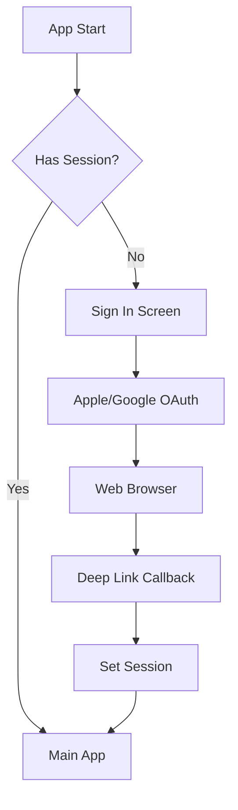

# Driplo Mobile App - Architecture & Implementation Plan

**Version:** 1.0  
**Created:** October 13, 2025  
**Estimated Timeline:** 6-8 weeks  
**Tech Stack:** React Native 0.82 + Expo SDK 54

## 📋 Executive Summary

This document outlines the complete architecture and implementation plan for the Driplo native mobile app. The app will be a C2C (consumer-to-consumer) marketplace for buying and selling fashion items, built with React Native and Expo, sharing the existing Supabase backend and design system with the web application.

## 🏗️ Architecture Overview

### Technology Stack

| Layer | Technology | Version | Rationale |
|-------|------------|---------|-----------|
| **Framework** | React Native | 0.82+ | New Architecture by default, React 19.1 support |
| **Platform** | Expo SDK | 54.0.0+ | Managed workflow, OTA updates, file-based routing |
| **Navigation** | Expo Router | 5.x | File-based routing, universal deep links |
| **State Management** | Zustand | 5.x | Lightweight, simple API |
| **Data Fetching** | TanStack Query | v5 | Server state management, caching |
| **Backend** | Supabase | Latest | Auth, Postgres, Realtime, Storage |
| **Styling** | NativeWind | 4.x | Tailwind CSS for React Native |
| **Payments** | Stripe React Native | Latest | Native payment UI |
| **Push Notifications** | Expo Notifications | 0.32+ | Cross-platform push service |

### Monorepo Structure

```
driplo-turbo-1/
├── apps/
│   ├── web/               # Existing SvelteKit app
│   └── mobile/            # New Expo React Native app
├── packages/
│   ├── ui/                # Shared UI components (React + Svelte)
│   ├── database/          # Supabase types (existing)
│   ├── domain/            # Business logic (existing)
│   ├── i18n/              # Shared translations (existing)
│   └── mobile-shared/     # Mobile-specific shared code
├── pnpm-workspace.yaml
├── turbo.json
└── package.json
```

## 📊 Data Model

The mobile app will use the existing Supabase database schema with the following key tables:

### Core Tables
- **profiles** - User profiles and authentication data
- **products** - Product listings with images, descriptions, pricing
- **product_images** - Product image URLs and metadata
- **categories** - Product categories and hierarchy
- **conversations** - Chat conversations between users
- **messages** - Individual messages within conversations
- **orders** - Purchase orders and transactions
- **favorites** - User favorited products
- **notifications** - Push notification data

### Security Model
- Row Level Security (RLS) policies on all tables
- Users can only access their own data
- Public read access for active products
- Secure file uploads via signed URLs

## 🎨 Design System

### Shared Design Tokens
The mobile app will use the existing design token system from `DESIGN_TOKENS.md`:

- **Color Palette:** Charcoal, Indigo, Burgundy, Gold, Emerald
- **Typography:** Inter font family with fluid scaling
- **Spacing:** 4px rhythm system with touch-friendly targets
- **Dark Mode:** Full support with system preference detection

### Mobile-Specific Adaptations
- Larger touch targets (44px minimum)
- Native gestures and animations
- Platform-specific UI patterns
- Safe area handling for notched devices

## 🔐 Authentication Flow

### OAuth Providers
- **Apple Sign In** (required for iOS)
- **Google Sign In** (optional)
- **Email Magic Links** (fallback)

### Deep Linking
- Universal links: `app.driplo.xyz`
- Custom scheme: `driplo://`
- OAuth callbacks: `/auth/callback`
- Product links: `/product/[id]`
- Message links: `/messages/[id]`

## 📱 Core Features

### 1. Authentication
- OAuth flow with Apple/Google
- Magic link email authentication
- Secure token storage with AsyncStorage
- Biometric authentication option

### 2. Product Discovery
- Home feed with algorithmic sorting
- Category browsing with filters
- Search with real-time results
- Advanced filtering (price, condition, location)
- Favorites management

### 3. Product Management
- Multi-step listing creation
- Photo upload with compression
- Price suggestions based on market data
- Inventory management
- Listing analytics

### 4. Messaging
- Real-time chat with Supabase Realtime
- Image and text messages
- Typing indicators
- Push notifications for new messages
- Message read receipts

### 5. Checkout & Payments
- Stripe PaymentSheet integration
- Payment intent creation via Edge Functions
- Order status tracking
- Shipping management
- Review and rating system

### 6. User Profile
- Profile customization
- Sales and purchase history
- Ratings and reviews
- Payout management
- Settings and preferences

## 🔧 Technical Implementation

### Phase 0: Monorepo Preparation (1 day)

#### Tasks
1. Configure `.npmrc` for React Native compatibility
2. Update `pnpm-workspace.yaml` to include mobile app
3. Add React 19.1 resolution to root `package.json`
4. Update `turbo.json` with mobile build tasks

#### Validation
- [ ] `.npmrc` contains `node-linker=hoisted`
- [ ] Workspace resolves correctly
- [ ] Turbo pipeline includes mobile tasks

### Phase 1: Expo App Initialization (2-3 days)

#### Tasks
1. Create Expo app with Expo Router template
2. Configure `app.json` for production settings
3. Install core dependencies
4. Configure NativeWind with Tailwind
5. Set up TypeScript for monorepo

#### Key Files Created
```
apps/mobile/
├── app/
│   ├── _layout.tsx        # Root layout with navigation
│   ├── (tabs)/           # Tab navigation
│   ├── (auth)/           # Authentication screens
│   └── +not-found.tsx    # 404 screen
├── components/           # Reusable components
├── constants/           # App constants
├── hooks/              # Custom React hooks
├── lib/                # Utility functions
├── app.json            # Expo configuration
├── package.json        # Dependencies
├── tsconfig.json       # TypeScript config
├── tailwind.config.js  # Tailwind configuration
└── babel.config.js     # Babel configuration
```

### Phase 2: Shared Package Integration (2 days)

#### Tasks
1. Create `packages/mobile-shared` for mobile-specific code
2. Link existing workspace packages
3. Create Supabase client with AsyncStorage
4. Set up authentication provider
5. Configure shared types and utilities

#### Mobile Shared Package Structure
```
packages/mobile-shared/
├── src/
│   ├── lib/
│   │   ├── supabase.ts      # Supabase client
│   │   ├── notifications.ts  # Push notifications
│   │   └── storage.ts        # File upload utilities
│   ├── providers/
│   │   ├── AuthProvider.tsx  # Authentication state
│   │   └── QueryProvider.tsx # React Query setup
│   ├── hooks/
│   │   ├── useAuth.ts        # Authentication hook
│   │   ├── useChat.ts        # Real-time messaging
│   │   └── useUpload.ts      # File upload hook
│   ├── components/
│   │   ├── ProductCard.tsx   # Reusable product card
│   │   ├── MessageBubble.tsx # Chat message UI
│   │   └── ImageGallery.tsx  # Image viewer
│   └── utils/
│       ├── formatting.ts     # Text formatting
│       ├── validation.ts     # Form validation
│       └── constants.ts      # App constants
```

### Phase 3: Authentication & Deep Linking (3-4 days)

#### Tasks
1. Configure OAuth providers in Supabase
2. Implement OAuth flow with expo-auth-session
3. Handle deep link callbacks
4. Configure universal links (iOS AASA, Android assetlinks)
5. Set up biometric authentication

#### Authentication Flow


### Phase 4: EAS & CI/CD Setup (1-2 days)

#### Tasks
1. Initialize EAS project
2. Configure environment secrets
3. Run first development build
4. Set up GitHub Actions CI
5. Configure OTA updates

#### EAS Configuration
```json
{
  "build": {
    "development": {
      "developmentClient": true,
      "distribution": "internal"
    },
    "preview": {
      "distribution": "internal",
      "channel": "preview"
    },
    "production": {
      "channel": "production",
      "autoIncrement": true
    }
  },
  "submit": {
    "production": {
      "ios": {
        "appleId": "your-apple-id@example.com",
        "ascAppId": "YOUR_ASC_APP_ID"
      },
      "android": {
        "serviceAccountKeyPath": "./service-account.json"
      }
    }
  }
}
```

### Phase 5: Core Features Implementation (4-6 weeks)

#### Feature 5.1: Home Feed & Product Listings (1 week)
- Infinite scroll with FlatList
- Product card components
- Search and filtering
- Category navigation
- Pull-to-refresh

#### Feature 5.2: Product Detail Screen (1 week)
- Image gallery with zoom
- Seller information
- Favorite functionality
- Share functionality
- Related products

#### Feature 5.3: Sell Flow (1.5 weeks)
- Multi-step form wizard
- Photo upload with compression
- Category selection
- Price suggestions
- Preview and publish

#### Feature 5.4: Messages/Chat (1 week)
- Real-time messaging
- Image sharing
- Typing indicators
- Push notifications
- Conversation list

#### Feature 5.5: Checkout & Orders (1 week)
- Stripe PaymentSheet integration
- Address management
- Order tracking
- Review system
- Purchase history

#### Feature 5.6: User Profile (0.5 week)
- Profile editing
- Listings management
- Sales analytics
- Settings screen
- Logout functionality

### Phase 6: Testing & QA (1 week)

#### Testing Strategy
- **Unit Tests:** Jest + React Native Testing Library
- **Integration Tests:** Supabase integration
- **E2E Tests:** Maestro or Detox
- **Manual QA:** Device testing on iOS/Android

#### Test Coverage Goals
- Authentication flows: 100%
- Core features: 80%
- Edge cases: 60%
- Accessibility: WCAG AA compliance

### Phase 7: Production Release (1 week)

#### Release Checklist
- [ ] Production builds signed and ready
- [ ] App Store Connect configured
- [ ] Google Play Console configured
- [ ] Crash reporting (Sentry) active
- [ ] Analytics (PostHog) tracking
- [ ] OTA update channel configured
- [ ] Support documentation ready

## 🚀 Performance Optimizations

### Image Handling
- Lazy loading with `expo-image`
- Progressive loading with blur placeholders
- Compression on upload
- Caching with AsyncStorage

### List Performance
- FlatList with getItemLayout
- Windowed rendering for large lists
- Optimized re-renders with React.memo
- Pagination with TanStack Query

### Network Optimization
- Request deduplication
- Background sync
- Offline support with cache
- Request retries with exponential backoff

## 🔒 Security Considerations

### Data Protection
- All API calls over HTTPS
- Sensitive data encrypted at rest
- Secure storage for tokens
- Certificate pinning (optional)

### Authentication Security
- Short-lived access tokens
- Secure token refresh
- Device binding
- Rate limiting

### Platform Security
- App signing certificates
- Obfuscation with JSCrambler (optional)
- Root/jailbreak detection
- Anti-tampering checks

## 📊 Analytics & Monitoring

### Crash Reporting
- Sentry with source maps
- Breadcrumbs for user actions
- Contextual data (device, OS, app version)
- Custom error boundaries

### Product Analytics
- Screen view tracking
- User funnel analysis
- Feature usage metrics
- Performance monitoring

### Custom Events
- `app_open`
- `sign_in`
- `list_item`
- `view_item`
- `start_chat`
- `send_message`
- `start_checkout`
- `payment_success`

## 🌍 Internationalization

### Supported Languages
- English (en) - Primary
- Bulgarian (bg) - Secondary

### Implementation
- Shared i18n package from `@repo/i18n`
- Device locale detection
- RTL support via I18nManager
- Currency formatting
- Date/time localization

## ♿ Accessibility

### WCAG AA Compliance
- Screen reader support (VoiceOver/TalkBack)
- High contrast mode
- Large text support
- Focus management
- Haptic feedback

### Testing
- Accessibility inspector
- Screen reader testing
- Keyboard navigation
- Color contrast verification

## 🔄 Offline Support

### Caching Strategy
- Query cache persistence
- Image caching
- Draft saving
- Sync on reconnect

### Offline Features
- View favorited products
- Browse cached categories
- Read message history
- Draft listings

## 📱 Platform-Specific Features

### iOS
- Apple Sign In
- Universal Links
- Dynamic Type
- Haptic Touch
- Spotlight Search

### Android
- Material Design 3
- App Shortcuts
- Share Sheet
- Picture-in-Picture
- Split Screen

## 🧪 Testing Strategy

### Unit Tests
```typescript
// Example: Authentication hook test
import { renderHook, waitFor } from '@testing-library/react-native';
import { useAuth } from '@repo/mobile-shared';
import { supabase } from '@repo/mobile-shared/lib/supabase';

describe('useAuth', () => {
  it('should initialize with loading state', () => {
    const { result } = renderHook(() => useAuth());
    expect(result.current.loading).toBe(true);
  });

  it('should load user session on mount', async () => {
    const { result } = renderHook(() => useAuth());
    await waitFor(() => {
      expect(result.current.loading).toBe(false);
    });
    expect(result.current.user).toBeDefined();
  });
});
```

### E2E Tests
```yaml
# maestro-tests/auth-flow.yaml
appId: com.driplo.app
---
- launchApp
- tapOn: "Continue with Apple"
- extendedWaitUntil:
    visible: "Welcome to Driplo"
    timeout: 10000
```

## 🚦 Deployment Strategy

### Environment Configuration
- **Development:** Local Supabase, hot reload
- **Staging:** Production Supabase, EAS Preview
- **Production:** Production Supabase, EAS Production

### Release Process
1. Create release branch
2. Run full test suite
3. Build with EAS
4. Test on physical devices
5. Submit to app stores
6. Monitor for issues
7. Rollback plan ready

## 📈 Success Metrics

### Technical KPIs
- App cold start < 2.5s
- Crash-free rate > 99.5%
- API response time (p95) < 500ms
- Image upload < 5s on 4G

### Product KPIs
- 7-day retention > 40%
- Listing creation rate > 15%
- Message response time < 1 hour
- Search → Purchase conversion > 2%

## 🔄 Maintenance & Updates

### OTA Updates
- Non-native changes via EAS Update
- A/B testing with feature flags
- Rollback capability
- Update analytics

### Long-term Maintenance
- Dependency updates
- OS version support
- Performance monitoring
- User feedback integration

## 🎯 Next Steps

1. **Immediate:** Start with Phase 0 (Monorepo Preparation)
2. **Week 1:** Complete Phases 1-2 (App setup + Shared packages)
3. **Week 2:** Implement Authentication (Phase 3)
4. **Week 3:** Set up CI/CD (Phase 4)
5. **Weeks 4-9:** Build core features (Phase 5)
6. **Week 10:** Testing and QA (Phase 6)
7. **Week 11:** Production release (Phase 7)

## 📚 Resources

- [Expo Documentation](https://docs.expo.dev/)
- [React Native 0.82 Release Notes](https://reactnative.dev/blog/2025/10/08/react-native-0.82)
- [Supabase React Native Guide](https://supabase.com/docs/guides/getting-started/quickstarts/react-native)
- [EAS Build Documentation](https://docs.expo.dev/build/introduction/)
- [NativeWind Documentation](https://www.nativewind.dev/)

---

**Prepared by:** Kilo Code (Architect Mode)  
**Next Action:** Switch to Code mode to begin implementation