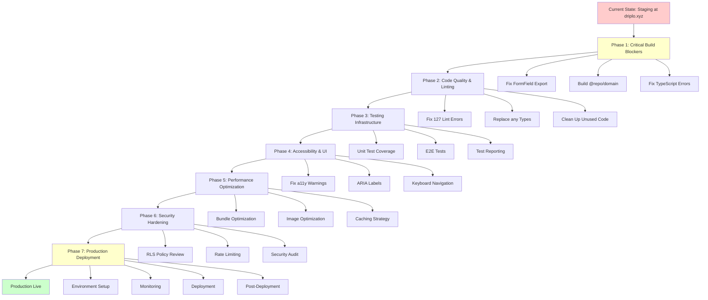
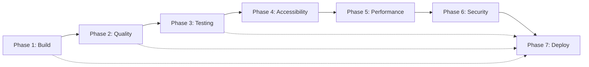
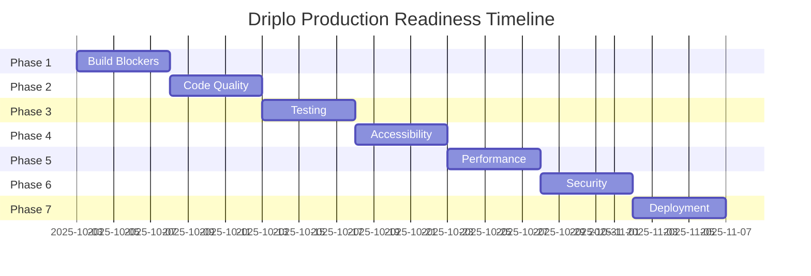
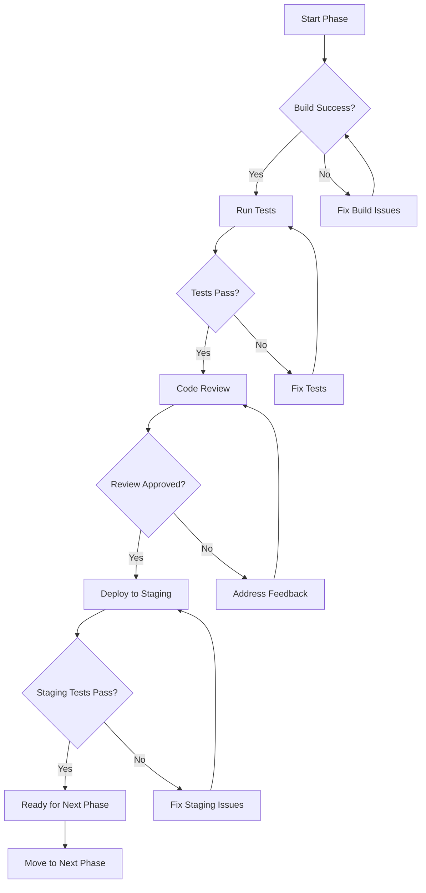
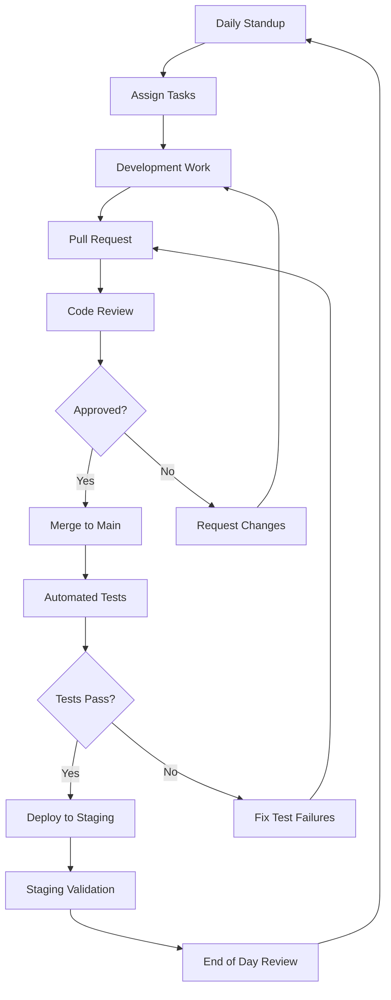
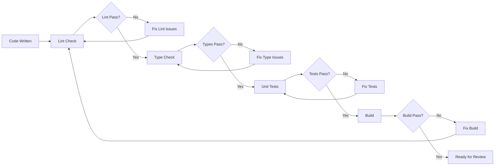
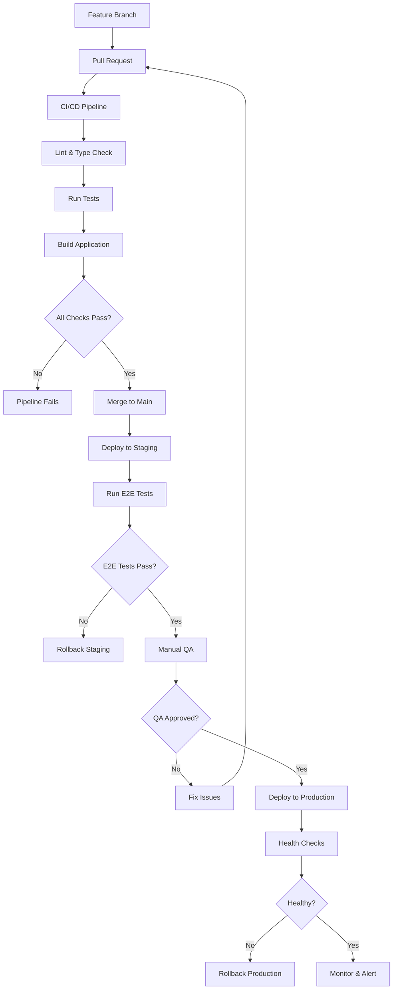
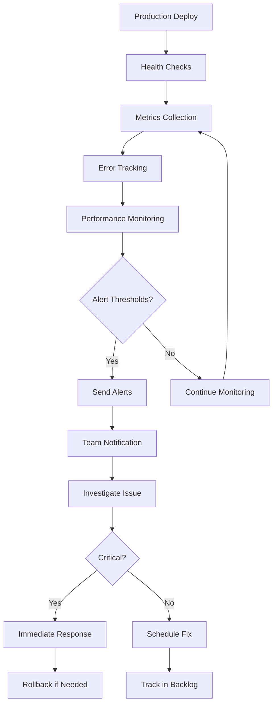

# Driplo Production Readiness Workflow

## Phase Dependencies

## Critical Path

## Risk Mitigation Flow

## Team Coordination Flow

## Quality Gates

## Deployment Pipeline

## Monitoring & Alerting Flow

---

## Key Decision Points

### Phase Gates
Each phase must meet these criteria before proceeding:
1. All build issues resolved
2. Tests passing
3. Code review approved
4. Staging validation successful

### Go/No-Go Decisions
- **Phase 1 Complete**: Build system working
- **Phase 3 Complete**: Test coverage adequate
- **Phase 5 Complete**: Performance benchmarks met
- **Phase 6 Complete**: Security audit passed
- **Phase 7 Complete**: Production ready

### Rollback Triggers
- Critical errors in production
- Performance degradation >50%
- Security vulnerability discovered
- User impact reported

---

## Communication Plan

### Daily
- Morning standup (15 min)
- Progress update in team chat
- Blocker identification

### Weekly
- Phase review meeting
- Stakeholder update
- Risk assessment

### Milestones
- Phase completion announcement
- Production readiness report
- Go-live notification

---

*This workflow diagram provides a visual representation of the entire production readiness process. Team members should refer to this to understand dependencies and critical paths.*