# Refactor Workflow Diagram

## Overall Refactor Flow

## Package Structure Transformation

## Dependency Reduction Flow

## Risk Mitigation Strategy

## CLI Agent Integration Points

## Critical Path Timeline

## Success Metrics Dashboard

```mermaid
graph TD
    A[Success Metrics] --> B[Package Count: 770→200]
    A --> C[Build Time: -50%]
    A --> D[Bundle Size: -40%]
    A --> E[Type Errors: 0]
    A --> F[Lint Errors: 0]
    A --> G[Test Coverage: 60%+]
    A --> H[Production Crashes: 0]
    
    B --> B1[74% reduction]
    C --> C1[Faster builds]
    D --> D1[Better performance]
    E --> E1[Full type safety]
    F --> F1[Clean code]
    G --> G1[Quality assurance]
    H --> H1[Stability]
```

## Decision Tree for Issues

This diagram helps visualize the entire refactor process, making it easier to understand the flow and dependencies between phases.