# SvelteKit 2 Complete Compliance Fix Plan

## 🎯 **Executive Summary**

This plan addresses **critical SvelteKit 2 compliance violations** that are currently preventing production deployment. The codebase contains build-breaking syntax errors, architectural violations, and incomplete migrations that must be fixed systematically.

**Current Status:** ❌ **BUILD FAILING** - Not production ready
**Target Status:** ✅ **100% SvelteKit 2 Compliant** - Production ready
**Estimated Timeline:** 6-8 hours of focused development
**Risk Level:** HIGH (build failures, runtime errors, data security issues)

---

## 📋 **Critical Issues Summary**

| Issue Category | Severity | Impact | Files Affected |
|---|---|---|---|
| SvelteKit 2 Migration Syntax | 🔴 CRITICAL | Build failures, runtime crashes | 15+ files |
| Svelte 5 Runes State Issues | 🔴 CRITICAL | Broken reactivity | 3 files |
| Missing Error Boundaries | 🟡 HIGH | Poor error handling, UX crashes | 3 route groups |
| Load Function Architecture | 🟡 MEDIUM | Security, performance issues | 8 files |
| Page Options Configuration | 🟡 MEDIUM | SEO, performance suboptimal | 12 files |

---

## 🗺️ **Phase-Based Execution Plan**

### **Phase 1: Critical Build Fixes** ⚡ (2-3 hours)
*Priority: URGENT - Must complete first*

#### **Task 1.1: Fix SvelteKit 2 Migration Syntax**
**Severity:** 🔴 CRITICAL
**Files Affected:** 15+ server files

**Issues to Fix:**
```typescript
// ❌ WRONG - SvelteKit 1 (Build Breaking)
throw redirect(303, '/path');
throw error(404, 'Not found');

// ✅ CORRECT - SvelteKit 2
redirect(303, '/path');
error(404, 'Not found');
```

**Specific Files to Fix:**
1. `apps/web/src/routes/(auth)/login/+page.server.ts:110`
2. `apps/web/src/routes/(protected)/dashboard/earnings/+page.ts:8`
3. `apps/web/src/routes/(protected)/dashboard/profile/+page.ts:8`
4. `apps/web/src/routes/(protected)/dashboard/sold/+page.ts:8`
5. All form action files with `throw redirect()`
6. All load functions with `throw error()`

**Action Steps:**
1. Run automated migration: `npx sv migrate sveltekit-2`
2. Manual search and replace: `throw redirect(` → `redirect(`
3. Manual search and replace: `throw error(` → `error(`
4. Update imports to remove throwing behavior expectations
5. Test each file compiles correctly

**Acceptance Criteria:**
- [ ] Zero `throw redirect()` instances remain
- [ ] Zero `throw error()` instances remain
- [ ] All server files compile without syntax errors
- [ ] TypeScript build passes

#### **Task 1.2: Fix Svelte 5 Runes State Issues**
**Severity:** 🔴 CRITICAL
**File:** `apps/web/src/lib/stores/auth-popup.svelte.ts`

**Current Issue:**
```typescript
// ❌ WRONG - Only captures initial value
return { state: state2, actions: actions2 };
```

**Fix Required:**
```typescript
// ✅ CORRECT - Proper reactive reference
return {
  get state() { return state2; },
  actions: actions2
};
```

**Action Steps:**
1. Audit all `.svelte.ts` files for state capture issues
2. Fix reactive state references
3. Test state reactivity in browser
4. Ensure no Svelte 5 rune warnings remain

**Acceptance Criteria:**
- [ ] No "state_referenced_locally" warnings
- [ ] State updates propagate correctly
- [ ] Auth popup functions work as expected

#### **Task 1.3: Verify Build Success**
**Action Steps:**
1. Run `pnpm --filter web check-types` - Must pass
2. Run `pnpm --filter web build` - Must pass
3. Verify no build errors or warnings
4. Test production build boots correctly

**Acceptance Criteria:**
- [ ] TypeScript check passes with zero errors
- [ ] Production build completes successfully
- [ ] No critical Svelte compilation warnings

---

### **Phase 2: Error Handling & Route Security** 🛡️ (2 hours)

#### **Task 2.1: Implement Missing Error Boundaries**
**Severity:** 🟡 HIGH
**Impact:** User experience, error recovery

**Missing Error Boundaries:**
1. `apps/web/src/routes/(auth)/+error.svelte`
2. `apps/web/src/routes/(protected)/+error.svelte`
3. Enhanced root error boundary

**Template for Auth Error Boundary:**
```svelte
<!-- (auth)/+error.svelte -->
<script lang="ts">
  import { page } from '$app/state';
  import { Button } from '@repo/ui';
  import { goto } from '$app/navigation';

  const error = $derived(page.error as App.Error);
  const status = $derived(page.status);

  const errorTitle = $derived.by(() => {
    if (status === 401) return 'Authentication Required';
    if (status === 403) return 'Access Denied';
    if (status === 404) return 'Page Not Found';
    if (status >= 500) return 'Server Error';
    return 'Authentication Error';
  });

  const errorMessage = $derived.by(() => {
    switch (status) {
      case 401:
        return 'Please log in to access this page.';
      case 403:
        return 'You do not have permission to access this resource.';
      case 404:
        return 'The authentication page you requested was not found.';
      case 500:
        return 'An error occurred during authentication. Please try again.';
      default:
        return error?.message || 'An unexpected authentication error occurred.';
    }
  });

  function handleBackToLogin() {
    goto('/login');
  }

  function handleBackToHome() {
    goto('/');
  }
</script>

<svelte:head>
  <title>Auth Error {status} | Driplo</title>
  <meta name="robots" content="noindex, nofollow" />
</svelte:head>

<div class="auth-error-container min-h-screen bg-gradient-to-br from-blue-50 to-indigo-50 flex items-center justify-center px-4 py-16">
  <div class="max-w-md mx-auto text-center">
    <!-- Error Icon -->
    <div class="mx-auto flex items-center justify-center w-20 h-20 mb-6">
      {#if status === 401 || status === 403}
        <svg class="w-full h-full text-blue-500" fill="none" stroke="currentColor" viewBox="0 0 24 24">
          <path stroke-linecap="round" stroke-linejoin="round" stroke-width="1.5" d="M12 15v2m-6 4h12a2 2 0 002-2v-6a2 2 0 00-2-2H6a2 2 0 00-2 2v6a2 2 0 002 2zm10-10V7a4 4 0 00-8 0v4h8z" />
        </svg>
      {:else}
        <svg class="w-full h-full text-amber-500" fill="none" stroke="currentColor" viewBox="0 0 24 24">
          <path stroke-linecap="round" stroke-linejoin="round" stroke-width="1.5" d="M12 8v4m0 4h.01M21 12a9 9 0 11-18 0 9 9 0 0118 0z" />
        </svg>
      {/if}
    </div>

    <!-- Status Code -->
    <div class="text-5xl font-bold text-blue-600 mb-4">
      {status}
    </div>

    <!-- Error Title -->
    <h1 class="text-2xl font-bold text-gray-900 mb-4">
      {errorTitle}
    </h1>

    <!-- Error Message -->
    <p class="text-gray-600 mb-8">
      {errorMessage}
    </p>

    <!-- Action Buttons -->
    <div class="flex flex-col sm:flex-row gap-4 justify-center">
      <Button
        onclick={handleBackToLogin}
        variant="primary"
        size="lg"
      >
        Go to Login
      </Button>
      <Button
        onclick={handleBackToHome}
        variant="outline"
        size="lg"
      >
        Back to Home
      </Button>
    </div>
  </div>
</div>
```

**Action Steps:**
1. Create `(auth)/+error.svelte` with auth-specific error handling
2. Create `(protected)/+error.svelte` with protected route error handling
3. Test error boundaries with simulated errors
4. Verify error recovery flows work correctly

**Acceptance Criteria:**
- [ ] Auth errors show appropriate messaging
- [ ] Protected route errors redirect correctly
- [ ] Error boundaries catch and display errors gracefully
- [ ] Users can recover from error states

#### **Task 2.2: Load Function Security Audit**
**Severity:** 🟡 MEDIUM
**Impact:** Data security, performance

**Files to Audit:**
1. `apps/web/src/routes/+layout.ts` - Contains database queries
2. All protected route load functions
3. Mixed server/universal patterns

**Action Steps:**
1. Identify database queries in universal loads
2. Move sensitive queries to `.server.ts` files
3. Ensure client-safe data only in universal loads
4. Add proper error handling for server loads

**Acceptance Criteria:**
- [ ] No database queries in universal loads
- [ ] Sensitive data only in server loads
- [ ] Proper error handling in all loads
- [ ] Performance optimized (no unnecessary client queries)

---

### **Phase 3: Architecture Optimization** ⚙️ (1.5 hours)

#### **Task 3.1: Page Options Configuration**
**Severity:** 🟡 MEDIUM
**Impact:** SEO, performance, caching

**Files Requiring Page Options:**
```typescript
// Static pages - Add prerender
export const prerender = true;

// Dynamic auth-dependent pages
export const prerender = false;
export const ssr = true;
export const csr = true;
```

**Static Pages to Configure:**
- `terms/+page.ts`
- `privacy/+page.ts`
- `privacy/cookies/+page.ts`
- `returns/+page.ts`
- `trust-safety/+page.ts`
- `offline/+page.ts`

**Dynamic Pages to Configure:**
- All protected routes
- Category pages
- Product pages
- Search pages

**Action Steps:**
1. Add `prerender = true` to all static legal pages
2. Add `prerender = false` to dynamic content pages
3. Configure SSR/CSR based on page requirements
4. Add `trailingSlash` configuration where needed
5. Test prerendered pages work correctly

**Acceptance Criteria:**
- [ ] Static pages prerender correctly
- [ ] Dynamic pages have proper SSR/CSR settings
- [ ] SEO meta tags work correctly
- [ ] Performance metrics improve

#### **Task 3.2: Form Actions Validation**
**Severity:** 🟡 LOW
**Impact:** User experience consistency

**Action Steps:**
1. Audit all form actions for consistent error handling
2. Ensure progressive enhancement works
3. Verify `use:enhance` implementations
4. Test form functionality without JavaScript

**Acceptance Criteria:**
- [ ] All forms work without JavaScript
- [ ] Progressive enhancement functions correctly
- [ ] Error handling is consistent
- [ ] Validation messages display properly

---

### **Phase 4: Testing & Validation** 🧪 (1 hour)

#### **Task 4.1: Comprehensive Testing Suite**
**Action Steps:**
1. **Build Testing:**
   ```bash
   pnpm --filter web check-types  # Must pass
   pnpm --filter web build        # Must pass
   pnpm --filter web lint         # Should pass with minimal warnings
   ```

2. **Runtime Testing:**
   - Test all critical user flows
   - Verify error boundaries trigger correctly
   - Test auth flows with errors
   - Verify protected route access control

3. **Performance Testing:**
   - Verify prerendered pages load quickly
   - Check bundle sizes are reasonable
   - Test client-side navigation performance

4. **SvelteKit 2 Compliance Testing:**
   - No deprecated syntax warnings
   - All redirects/errors use new syntax
   - Proper load function patterns
   - Error boundaries work correctly

**Acceptance Criteria:**
- [ ] All builds pass without errors
- [ ] Zero critical runtime errors
- [ ] Error recovery flows work
- [ ] Performance metrics acceptable
- [ ] 100% SvelteKit 2 compliance

#### **Task 4.2: Documentation Updates**
**Action Steps:**
1. Update README with SvelteKit 2 requirements
2. Document new error handling patterns
3. Update development setup instructions
4. Document any breaking changes made

**Acceptance Criteria:**
- [ ] Documentation reflects SvelteKit 2 patterns
- [ ] New developer setup instructions
- [ ] Error handling patterns documented

---

## 📊 **Risk Assessment & Mitigation**

### **High Risk Items:**
1. **Build Breaking Changes** 🔴
   - *Risk:* Syntax errors prevent deployment
   - *Mitigation:* Phase 1 must complete before other work
   - *Rollback:* Keep git commits atomic for easy rollback

2. **State Reactivity Issues** 🔴
   - *Risk:* UI becomes non-functional
   - *Mitigation:* Test each state fix thoroughly
   - *Rollback:* Maintain working state patterns as backup

3. **Auth Flow Disruption** 🟡
   - *Risk:* Users cannot log in/out
   - *Mitigation:* Test auth flows after each change
   - *Rollback:* Maintain current auth patterns until validated

### **Dependencies:**
- Phase 1 must complete before Phase 2
- Build must pass before testing phase
- Error boundaries depend on completed migrations

---

## 🚀 **Execution Timeline**

```mermaid
gantt
    title SvelteKit 2 Fix Timeline
    dateFormat HH:mm
    axisFormat %H:%M

    section Phase 1 (Critical)
    Syntax Migration    :crit, p1a, 00:00, 2h
    State Fixes         :crit, p1b, after p1a, 1h
    Build Validation    :crit, p1c, after p1b, 30min

    section Phase 2 (Security)
    Error Boundaries    :p2a, after p1c, 1.5h
    Load Audit         :p2b, after p2a, 30min

    section Phase 3 (Optimization)
    Page Options       :p3a, after p2b, 1h
    Forms Validation   :p3b, after p3a, 30min

    section Phase 4 (Testing)
    Testing Suite      :p4a, after p3b, 45min
    Documentation      :p4b, after p4a, 15min
```



**Total Estimated Time:** 6-8 hours

---

## ✅ **Success Criteria**

### **Technical Criteria:**
- [ ] `pnpm --filter web build` passes with zero errors
- [ ] `pnpm --filter web check-types` passes with zero errors
- [ ] No SvelteKit 2 deprecation warnings
- [ ] All error boundaries functional
- [ ] Auth flows work correctly
- [ ] Performance metrics within acceptable ranges

### **Compliance Criteria:**
- [ ] 100% SvelteKit 2 syntax compliance
- [ ] Proper error handling patterns
- [ ] Secure load function architecture
- [ ] Optimized page options configuration
- [ ] Production-ready build output

### **Quality Criteria:**
- [ ] Error recovery flows tested
- [ ] User experience maintains quality
- [ ] Performance does not degrade
- [ ] Security patterns improved
- [ ] Documentation updated

---

## 🎯 **Post-Completion Checklist**

- [ ] Full application smoke test
- [ ] Deploy to staging environment
- [ ] Performance baseline measurements
- [ ] Security audit passed
- [ ] Team review completed
- [ ] Documentation updated
- [ ] Deployment ready

---

## 📞 **Escalation & Support**

**If Issues Arise:**
1. **Build Failures:** Focus on Phase 1 syntax fixes first
2. **Runtime Errors:** Check error boundary implementations
3. **Performance Issues:** Review load function patterns
4. **Auth Problems:** Verify redirect syntax and error handling

**Resources:**
- [SvelteKit 2 Migration Guide](https://kit.svelte.dev/docs/migrating-to-sveltekit-2)
- [Svelte 5 Migration Guide](https://svelte.dev/docs/svelte/v5-migration-guide)
- [SvelteKit Error Handling](https://kit.svelte.dev/docs/errors)

---

*This plan ensures 100% SvelteKit 2 compliance and production readiness. Execute phases sequentially for optimal results.*